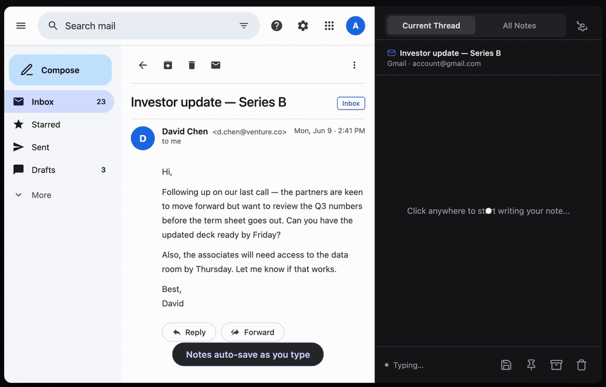

# Email Thread Notes

> Private, persistent notes for Gmail and Outlook — right inside your browser sidebar.




---

## What it does

Email Thread Notes adds a Chrome sidebar panel to Gmail and Outlook. Open any email thread, open the panel, and start typing — your note is automatically saved and permanently linked to that thread. Come back to the same email a month later and your note is right there.

All data stays in your browser. No accounts, no servers, no subscriptions.

---

## Features

### Notes
- **Auto-save** — notes save as you type (no button needed)
- **Rich text** — bold, italic, lists, and clickable links (Cmd/Ctrl+click to open; paste a URL to auto-link it)
- **RTL support** — full right-to-left text for Hebrew, Arabic, and other RTL languages
- **Cross-device sync** — notes sync automatically via Chrome Storage Sync across your signed-in Chrome browsers

### Organisation
- **Pin notes** — float important threads to the top of the list, under any sort order
- **Archive notes** — move notes you're done with to a collapsible Archived section; they're still searchable
- **Sort options** — Recent First · Oldest First · Alphabetical · **Recent Activity** (orders by the last email you saw in each thread)

### Search
- **Full-text search** across subjects and note previews
- **Highlighted matches** — search terms highlighted inline; preview window shifts so matches are always visible even in long notes
- **Auto-expand archive** — archived notes appear in search results with the section auto-expanded

### UX
- **Undo toast** — delete or archive a note and get 5 seconds to undo, with no browser confirm dialogs
- **Storage meter** — Settings panel shows how much of the 100 KB Chrome sync quota you're using
- **Kebab menu + right-click** — pin, archive, or delete from either the ⋮ button or a right-click on any card
- **Thread view controls** — Pin and Archive buttons live right in the note footer alongside Save and Delete

### Platforms
- **Gmail** — conversation view (both desktop layouts)
- **Outlook** — outlook.office365.com · outlook.office.com · outlook.live.com

---

## Install

### From GitHub (recommended)

1. Download [`email-thread-notes-v2.8.0.zip`](https://github.com/Amir5f/email-thread-notes/releases/tag/v2.8.0) from the latest release
2. Unzip the file
3. Open `chrome://extensions` in Chrome
4. Enable **Developer mode** (toggle in the top-right corner)
5. Click **Load unpacked** and select the unzipped folder
6. Open Gmail or Outlook — the extension icon appears in the toolbar

> **Note:** Chrome requires Developer mode for extensions not distributed through the Web Store. The extension ID is pinned via a manifest key, so it stays stable even if you move the folder.

### From source

```bash
git clone https://github.com/Amir5f/email-thread-notes.git
```

Then follow steps 3–6 above, pointing Load unpacked at the cloned folder.

---

## Usage

1. Open Gmail or Outlook and navigate to any email thread
2. Click the **Email Thread Notes** icon in the Chrome toolbar to open the sidebar
3. Type your note — it saves automatically
4. Switch to **All Notes** (top tab) to see, search, pin, and archive notes across all your threads

### Backup & restore

Settings (gear icon) → **Export Notes** saves a JSON file with all your notes and metadata. **Import Notes** restores from that file, useful when switching machines or browsers.

---

## Privacy

- Notes are stored in `chrome.storage.sync` — your browser's encrypted sync storage
- No data is sent to any external server
- No analytics, no tracking, no third-party SDKs
- Export gives you a portable JSON file you fully own

---

## Project layout

```
manifest.json          Extension manifest (MV3)
src/
  background.js        Service worker — storage actions, message routing
  sidebar.html/js      Side panel UI — all notes views, search, menus, toasts
  gmail-sidebar.js     Gmail content script — thread detection + last-email scraping
  outlook-sidebar.js   Outlook content script — same for Outlook
  milkdown-init.js     Rich text editor setup
lib/
  milkdown-bundle.js   Bundled Milkdown editor
assets/
  icons/               Extension icons
```

---

## Roadmap

- [ ] Chrome Web Store listing
- [ ] Gmail reading pane support
- [ ] Advanced filtering (by platform, date range, account)
- [ ] Keyboard shortcuts for save / toggle panel

---

## License

MIT — see [LICENSE](LICENSE) for details.
